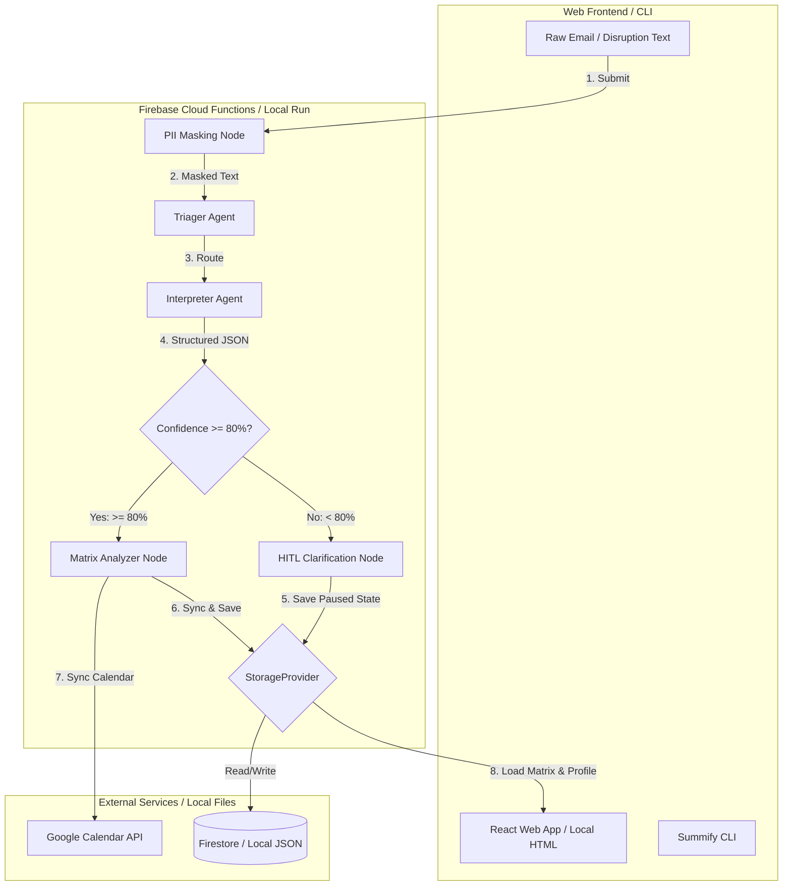

# Project Plan & Requirements: Summify ("In Summary:")

Summify is a concierge agent designed to ingest chaotic inbound scheduling emails (such as camp registrations or nanny updates), interpret them, maintain a multi-child schedule matrix, detect childcare gaps, and handle real-time disruptions. It features a 4-agent network built using the **Google Agent Development Kit (ADK 2.0)**, a custom **Model Context Protocol (MCP) Server** for local storage and Google Calendar integration, a **PII Data-Masking Framework** to protect family privacy, and a command-line interface (CLI) for seamless execution.

---

## Technical Architecture & Design Decisions

### 1. Multi-User Google Calendar OAuth 2.0 & Multi-Child Mapping
- **OAuth Approach**: To scale to hundreds of users, we will implement a standard three-legged OAuth 2.0 Web Server flow.
- **Local Dev / CLI**: The CLI will check for a local `tokens.json` cache. If missing, it will initiate a local OAuth flow, spawning a local web server to receive the authorization code and save the user's `refresh_token` locally.
- **Production / Web**: The production app will store user `refresh_token`s securely in **Firebase Firestore** under `users/{userId}/tokens/google_calendar`. The Python backend (Firebase Cloud Functions) will fetch and refresh these tokens on behalf of the authenticated user.
- **Zero Hardcoded Credentials**: Client IDs and secrets will be loaded via environment variables (`GOOGLE_CLIENT_ID`, `GOOGLE_CLIENT_SECRET`).
- **Multi-Child Calendar Mapping**: Support both single and multi-calendar setups. By default, events are synced to a single primary calendar with child-name prefixes (e.g., `[Emily] Soccer Camp`) and distinct event colors. Alternatively, users can configure dedicated secondary calendars per child in their profile.

### 2. Dynamic Profile-Based PII Masking & Storage Abstraction
- **Storage Abstraction**: To ensure the project scales from a local CLI to a web application, we will introduce a `StorageProvider` interface with two implementations:
  - `LocalStorageProvider`: Reads/writes profiles (`config/profile.json`) and schedule matrices (`data/matrix.json`) from the local file system. Used by the CLI in local mode and during unit tests.
  - `FirestoreStorageProvider`: Reads/writes profiles and matrices from **Firebase Firestore** under `users/{userId}/profile` and `users/{userId}/matrix`. Used by the web app and the CLI in Firebase mode.
- **Masking Engine**: 
  - Performs exact-match masking using the profile-defined family names (e.g., replacing "Emily" with `[CHILD_A]`).
  - Uses regex to detect and mask contact details (emails, phone numbers, and home addresses).
  - **Scope**: Only profile-defined family names and contact details are masked. Public names (such as camp names, coach names, and locations) are left unmasked to allow the LLM to extract accurate context.
- **Unmasking**: After the LLM generates the structured JSON output using placeholders, the workflow unmasks the data using the session's mapping before saving it or syncing it to Google Calendar. This ensures no PII is sent to the LLM.

### 3. Accessible UI Grid Aesthetics & Web Frontend
- **Technology Stack**: A modern, responsive web application built using **Vite + React + Vanilla CSS**.
- **Aesthetics**: Large, highly legible typography (base size 16px-18px, headings 24px+) using clean sans-serif fonts (Inter or Outfit) to accommodate parents. High-contrast light and dark modes (switchable). Gaps will be clearly highlighted in high-contrast red/crimson, and covered slots in soft teal/green.
- **Layout**: Children on one axis, days/weeks on the other.
- **Local Dev / CLI Mode**: The CLI will generate a static HTML file at `output/schedule.html` using Jinja2 templates and open it automatically in the default browser using Python's `webbrowser` module.
- **Production Mode**: The React web application will be hosted on **Firebase Hosting**, rendering the schedule matrix dynamically from Firestore and providing interactive controls.

### 4. Dual-Mode Gap Analysis & Baseline Coverage
- **Baseline Coverage**: To prevent normal school/daycare hours from being flagged as childcare gaps, the system supports defining 'recurring baseline coverage' in the profile (e.g., school from Mon-Fri 8:30 AM - 3:00 PM, Sep-June). The gap analyzer treats these baseline hours as active coverage.
- **Absolute Gaps**: Any weekday (Monday-Friday) between 9 AM and 5 PM where a child has no scheduled activity and is not covered by the baseline coverage.
- **Relative Gaps**: Sibling schedule mismatches (e.g., Sibling A is booked for a week of camp, but Sibling B has no scheduled care for that same week).

### 5. Disruption & Conflict Handling
- **Approach**: When a disruption is detected (e.g., a nanny calling out sick or a camp session being cancelled):
  - Keep the activity in the schedule matrix but mark its status as `DISRUPTED` or `CANCELLED`.
  - The gap analyzer will flag the affected time slot as a childcare gap.
  - The Google Calendar event title will be updated to prepend `[DISRUPTED]` or `[CANCELLED]` instead of deleting the event entirely, keeping a record of the disruption.

### 6. Asynchronous HITL Workflow State Persistence
- **Approach**: If the workflow's confidence score is < 80% (low confidence):
  - In **Local Mode**: The CLI will save the paused workflow state to a local file at `data/pending_workflow.json`, print the clarification question, and exit.
  - In **Production Mode**: The backend will save the paused workflow state to Firestore under `users/{userId}/pending_workflows/{workflowId}`. The user will be notified in the web dashboard, where they can answer the clarification question.
  - The user can resume the workflow via the CLI (`summify --resume '<clarification_input>'`) or the web UI.

### 7. Firebase Authentication & Backend Hosting
- **Authentication**: Users sign in to the web application using **Firebase Auth** via Google SSO or Email/Password.
- **CLI Authentication**: By default, the CLI runs in a local-first development mode (`LOCAL_DEV` bypass) using a mock user ID and local files. However, the CLI will also support authenticating against Firebase Auth using email/password via the Firebase Auth REST API, allowing developers and advanced users to interact with their production Firestore data from the terminal.
- **Backend Hosting**: The Python ADK 2.0 workflow and supporting APIs will be hosted on **Firebase Cloud Functions (Python)**. This provides a fully serverless, auto-scaling backend that integrates seamlessly with Firebase Auth and Firestore.

---

## Proposed Changes

We will organize the project into four main layers:
1. **Core Agent & Workflow Layer** (ADK 2.0, PII Masking, Storage Abstraction)
2. **Integration & Serverless Backend Layer** (Firebase Cloud Functions, Google Calendar API)
3. **Web Frontend Layer** (Vite, React, Firebase Auth, Vanilla CSS)
4. **Execution & CLI Layer** (CLI tool, Local HTML Generator)



### 1. Core Agent & Workflow Layer

#### [NEW] [schemas.py](file:///c:/Users/tyler/Git/InSummery-AI/app/schemas.py)
Pydantic schemas representing the data models for structured inputs and outputs.
- `ActivityDetail`: child name, activity title, start/end dates, daily start/end times.
- `InterpretationResult`: list of `ActivityDetail`, `confidence_score`, and `evaluation_trace`.
- `DisruptionDetail`: affected child, date, description, type (cancellation, delay).

#### [NEW] [storage.py](file:///c:/Users/tyler/Git/InSummery-AI/app/storage.py)
Defines the storage abstraction layer to decouple local execution from production cloud execution.
- `StorageProvider` (abstract base class):
    - `get_profile(user_id: str) -> dict`
    - `save_profile(user_id: str, profile: dict) -> None`
    - `get_matrix(user_id: str) -> dict`
    - `save_matrix(user_id: str, matrix: dict) -> None`
    - `get_pending_workflow(user_id: str, workflow_id: str) -> dict`
    - `save_pending_workflow(user_id: str, workflow_id: str, state: dict) -> None`
- `LocalStorageProvider`: Implements `StorageProvider` using local JSON files (`config/profile.json`, `data/matrix.json`, `data/pending_workflow.json`).
- `FirestoreStorageProvider`: Implements `StorageProvider` using Firebase Firestore.

#### [NEW] [pii_masker.py](file:///c:/Users/tyler/Git/InSummery-AI/app/pii_masker.py)
A PII masking utility that replaces sensitive family names and contact details with placeholders before sending data to the LLM, and restores them afterwards.
- Loaded dynamically using the user's profile from the active `StorageProvider`.

#### [NEW] [nodes.py](file:///c:/Users/tyler/Git/InSummery-AI/app/nodes.py)
Defines the workflow nodes:
- `pii_mask_node`: Masks incoming raw text.
- `triager_agent`: `LlmAgent` classifying text (registration vs disruption vs general).
- `interpreter_agent`: `LlmAgent` extracting structured schedule data.
- `confidence_gate_node`: Checks confidence score and decides whether to route to HITL or Matrix Analyzer.
- `hitl_node`: Yields `RequestInput` if confidence is low, and handles saving the paused state via the active `StorageProvider`.
- `matrix_analyzer_node`: Merges schedule, detects gaps (accounting for baseline coverage), and handles disruptions.
- `ui_designer_node`: Generates the HTML grid and alerts.

#### [NEW] [agent.py](file:///c:/Users/tyler/Git/InSummery-AI/app/agent.py)
Defines the root `Workflow` connecting all nodes with conditional edges.

---

### 2. Integration & Serverless Backend Layer

#### [NEW] [functions/main.py](file:///c:/Users/tyler/Git/InSummery-AI/functions/main.py)
Firebase Cloud Functions (Python) serving as the serverless backend.
- Exposes HTTP endpoints secured by Firebase Auth token verification:
  - `/api/process-email`: Accepts raw email text, runs the ADK workflow, and returns the result (or a pending workflow ID for HITL).
  - `/api/resume-workflow`: Resumes a paused workflow using the saved state from Firestore.
  - `/api/get-schedule`: Returns the current schedule matrix and detected gaps.
  - `/api/sync-calendar`: Syncs the current schedule matrix to Google Calendar.
- Integrates with the Google Calendar API using OAuth credentials retrieved from Firestore.

---

### 3. Web Frontend Layer

#### [NEW] [frontend/package.json](file:///c:/Users/tyler/Git/InSummery-AI/frontend/package.json)
Configures the Vite + React frontend project and dependencies (`firebase`, `react`, `react-dom`, `lucide-react`).

#### [NEW] [frontend/src/firebase.js](file:///c:/Users/tyler/Git/InSummery-AI/frontend/src/firebase.js)
Initializes Firebase Auth and Firestore.

#### [NEW] [frontend/src/App.jsx](file:///c:/Users/tyler/Git/InSummery-AI/frontend/src/App.jsx)
Main React application providing:
- **Authentication**: Sign-in page supporting Google SSO and Email/Password.
- **Dashboard**: A clean, accessible schedule grid displaying children on one axis and days/weeks on the other.
- **Alerts & Gaps**: Sidebar highlighting absolute and relative childcare gaps, along with active disruptions.
- **Ingestion Panel**: Textarea to paste chaotic emails or disruptions.
- **HITL Prompt**: Interactive modal prompting the user for clarification when the backend returns a low-confidence state.

#### [NEW] [frontend/src/index.css](file:///c:/Users/tyler/Git/InSummery-AI/frontend/src/index.css)
Responsive vanilla CSS styling implementing a premium dark/light mode, high-contrast typography, and smooth micro-animations.

---

### 4. Execution & CLI Layer

#### [NEW] [summify](file:///c:/Users/tyler/Git/InSummery-AI/bin/summify)
An executable CLI script that:
- Accepts raw text input via `--input` or `--disruption`.
- Supports a `--mode` flag (`local` or `firebase`).
  - In `local` mode (default), it uses `LocalStorageProvider` and runs the workflow entirely in-process.
  - In `firebase` mode, it uses the Firebase REST API to authenticate (via email/password) and sends requests to the Firebase Cloud Functions backend.
- If the workflow is interrupted (HITL), saves the state (or prints the pending workflow ID) and exits.
- Supports resuming a pending workflow via `--resume "<clarification_input>" --workflow-id "<id>"`.
- Displays the final HTML grid path and lists alert banners.

#### [NEW] [pyproject.toml](file:///c:/Users/tyler/Git/InSummery-AI/pyproject.toml)
Configures project dependencies (`google-adk`, `google-auth`, `google-api-python-client`, `pydantic`, `jinja2`, `firebase-admin`, `requests`) and registers the `summify` CLI command.

#### [NEW] [firebase.json](file:///c:/Users/tyler/Git/InSummery-AI/firebase.json)
Configures Firebase Hosting, Cloud Functions, and Firestore.

---

## Verification Plan

### Automated Tests
We will write unit and integration tests under the `tests/` directory:
- `tests/unit/test_pii_masker.py`: Test masking and unmasking functionality.
- `tests/unit/test_storage.py`: Verify that both `LocalStorageProvider` and `FirestoreStorageProvider` conform to the same interface.
- `tests/unit/test_matrix_logic.py`: Test schedule merging, baseline coverage integration, and gap detection.
- `tests/eval/eval_config.yaml` and `tests/eval/datasets/`: Set up an evaluation dataset for the Triager and Interpreter agents. Run:
  ```bash
  agents-cli eval run
  ```
  to verify classification accuracy and confidence score generation.

### Manual Verification
1. **Local CLI Disruption Demo**: Run:
   ```bash
   python bin/summify --mode local --disruption "Nanny called out sick for Tuesday July 7th"
   ```
   Verify that the system detects the disruption, recalculates the matrix, flags a childcare gap, and generates the HTML dashboard.
2. **Asynchronous HITL Flow Demo**: Run the CLI with ambiguous text in local mode:
   ```bash
   python bin/summify --mode local --input "Camp next week for Tyler"
   ```
   Verify that the CLI exits, saves the paused state to `data/pending_workflow.json`, and prints the clarification question. Resume it using:
   ```bash
   python bin/summify --mode local --resume "I mean soccer camp at 9am"
   ```
   Verify that the workflow resumes and successfully finishes.
3. **Web Interface & Firebase Auth**: Run the Vite dev server, register a user using email/password, and log in. Test the Google SSO flow.
4. **Cloud Function E2E Execution**: Paste a scheduling email into the React web app. Verify that the request is sent to the Python Cloud Function, executes the workflow, stores the resulting matrix in Firestore, and updates the UI grid in real-time.
5. **Google Calendar Sync**: Verify that events are correctly created and updated in Google Calendar. Check that disrupted events are marked with `[DISRUPTED]` instead of deleted.
