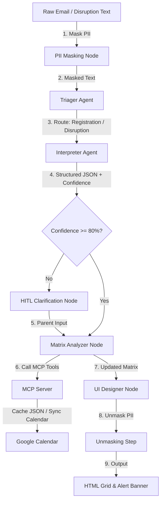

# Project Plan & Requirements: Summify ("In Summary:")

Summify is a concierge agent designed to ingest chaotic inbound scheduling emails (such as camp registrations or nanny updates), interpret them, maintain a multi-child schedule matrix, detect childcare gaps, and handle real-time disruptions. It features a 4-agent network built using the **Google Agent Development Kit (ADK 2.0)**, a custom **Model Context Protocol (MCP) Server** for local storage and Google Calendar integration, a **PII Data-Masking Framework** to protect family privacy, and a command-line interface (CLI) for seamless execution.

---

## Technical Architecture & Design Decisions

### 1. Multi-User Google Calendar OAuth 2.0
- **Approach**: To scale to hundreds of users, we will implement a standard three-legged OAuth 2.0 Web Server flow.
- **Local Dev / CLI**: The CLI will check for a local `tokens.json` cache. If missing, it will initiate a local OAuth flow, spawning a local web server to receive the authorization code and save the user's `refresh_token`.
- **Production**: The production app will store user `refresh_token`s in a secure database. The MCP server will be configured to fetch/refresh these tokens on behalf of the active user.
- **Zero Hardcoded Credentials**: Client IDs and secrets will be loaded via environment variables (`GOOGLE_CLIENT_ID`, `GOOGLE_CLIENT_SECRET`).

### 2. Dynamic Profile-Based PII Masking
- **Approach**: Rather than hardcoding names in a `.env` file, the PII Masker will be initialized dynamically per request.
- **Workflow State**: When a user submits an email, their profile (including children's names and parent names) is loaded into the workflow's `ctx.state`.
- **Masking Engine**: 
  - Uses the profile names to perform exact-match masking (e.g., replacing "Emily" with `[CHILD_A]`).
  - Uses regex and lightweight Named Entity Recognition (NER) to detect and mask email addresses, phone numbers, and street addresses.
- **Unmasking**: After the LLM generates the structured JSON output using placeholders, the workflow unmasks the data using the session's mapping before saving it or syncing it to Google Calendar. This ensures no PII is sent to the LLM.

### 3. Accessible UI Grid Aesthetics
- **Approach**: Design a responsive HTML dashboard built with vanilla CSS.
- **Typography**: Large, highly legible typography (base size 16px-18px, headings 24px+) using clean sans-serif fonts (e.g., Inter or Outfit) to accommodate parents with older eyes.
- **Color Theme**: High-contrast light and dark modes (switchable). Gaps will be clearly highlighted in high-contrast red/crimson, and covered slots in soft teal/green.
- **Layout**: Children on one axis, days/weeks on the other.

### 4. Dual-Mode Gap Analysis
- **Absolute Gaps**: Any weekday (Monday-Friday) between 9 AM and 5 PM where a child has no scheduled activity.
- **Relative Gaps**: Sibling schedule mismatches (e.g., Sibling A is booked for a week of camp, but Sibling B has no scheduled care for that same week).

---

## Proposed Changes

We will organize the project into three main layers:
1. **Core Agent & Workflow Layer** (ADK 2.0, PII Masking)
2. **Integration Layer** (MCP Server for local caching & Google Calendar)
3. **Execution & UI Layer** (CLI tool, HTML Grid Generator)



### 1. Core Agent & Workflow Layer

#### [NEW] [schemas.py](file:///Users/tylerstahl/antigravity/InSummery-AI/app/schemas.py)
Pydantic schemas representing the data models for structured inputs and outputs.
- `ActivityDetail`: child name, activity title, start/end dates, daily start/end times.
- `InterpretationResult`: list of `ActivityDetail`, `confidence_score`, and `evaluation_trace`.
- `DisruptionDetail`: affected child, date, description, type (cancellation, delay).

#### [NEW] [pii_masker.py](file:///Users/tylerstahl/antigravity/InSummery-AI/app/pii_masker.py)
A PII masking utility that replaces sensitive information (children's names, locations, email addresses) with placeholders before sending data to the LLM, and restores them afterwards.
- Loaded dynamically using the user's profile names from `ctx.state`.

#### [NEW] [nodes.py](file:///Users/tylerstahl/antigravity/InSummery-AI/app/nodes.py)
Defines the workflow nodes:
- `pii_mask_node`: Masks incoming raw text.
- `triager_agent`: `LlmAgent` classifying text.
- `interpreter_agent`: `LlmAgent` extracting structured schedule data.
- `confidence_gate_node`: Checks confidence score and decides whether to route to HITL or Matrix Analyzer.
- `hitl_node`: Yields `RequestInput` if confidence is low, and handles resuming.
- `matrix_analyzer_node`: Merges schedule, detects gaps, and calls MCP tools.
- `ui_designer_node`: Generates the HTML grid and alerts.

#### [NEW] [agent.py](file:///Users/tylerstahl/antigravity/InSummery-AI/app/agent.py)
Defines the root `Workflow` connecting all nodes with conditional edges.

---

### 2. Integration Layer (MCP Server)

#### [NEW] [mcp_server.py](file:///Users/tylerstahl/antigravity/InSummery-AI/mcp_server.py)
A local MCP server utilizing the `mcp` SDK.
- Exposes `read_matrix()` and `write_matrix()` to safely store schedule matrices in `data/matrix.json`.
- Exposes `sync_calendar_events()` to interface with the Google Calendar API.
- Handles OAuth token refreshing and local storage securely.

---

### 3. Execution & UI Layer

#### [NEW] [summify](file:///Users/tylerstahl/antigravity/InSummery-AI/bin/summify)
An executable CLI script (or Python script exposed via `pyproject.toml`) that:
- Accepts raw text input via `--input` or `--disruption`.
- Boots up the `InMemoryRunner` for the ADK workflow.
- If the workflow is interrupted (HITL), prompts the user in the terminal, receives input, and resumes.
- Displays the final HTML grid path and lists alert banners.

#### [NEW] [pyproject.toml](file:///Users/tylerstahl/antigravity/InSummery-AI/pyproject.toml)
Configures project dependencies (`google-adk`, `mcp`, `google-auth`, `google-api-python-client`, `pydantic`, `jinja2`) and registers the `summify` CLI command.

#### [NEW] [.env.example](file:///Users/tylerstahl/antigravity/InSummery-AI/.env.example)
Template for environment variables (e.g., Google Client ID/Secret, family names, region).

---

## Verification Plan

### Automated Tests
We will write unit and integration tests under the `tests/` directory:
- `tests/unit/test_pii_masker.py`: Test masking and unmasking functionality.
- `tests/unit/test_matrix_logic.py`: Test schedule merging and gap detection logic.
- `tests/eval/eval_config.yaml` and `tests/eval/datasets/`: Set up an evaluation dataset for the Triager and Interpreter agents. Run:
  ```bash
  agents-cli eval run
  ```
  to verify classification accuracy and confidence score generation.

### Manual Verification
1. **CLI Disruption Demo**: Run:
   ```bash
   python bin/summify --disruption "Nanny called out sick for Tuesday July 7th"
   ```
   Verify that the system detects the disruption, recalculates the matrix, flags a childcare gap, and shows a warning banner.
2. **HITL Flow Demo**: Run the CLI with ambiguous text (e.g., "Camp next week for Tyler") to trigger a confidence score < 80%. Verify that the CLI pauses, prompts the user for clarification, and successfully resumes.
3. **Calendar Sync**: Verify that events are correctly created and updated in Google Calendar.
4. **UI Inspection**: Open the generated HTML grid in a browser and verify the visual layout and gap highlights.
